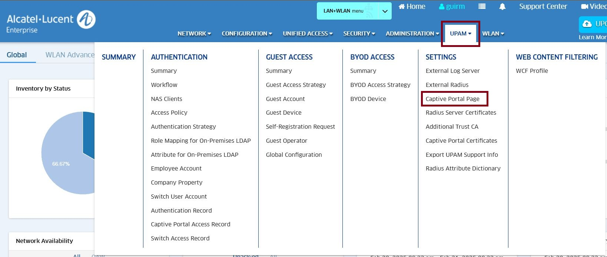
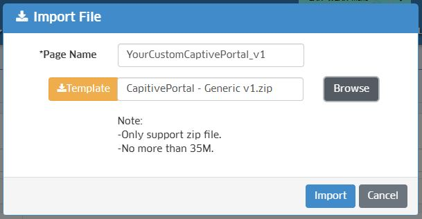
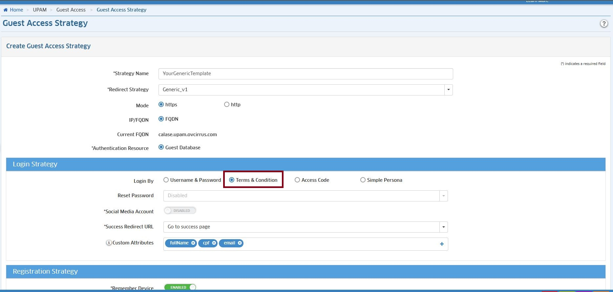
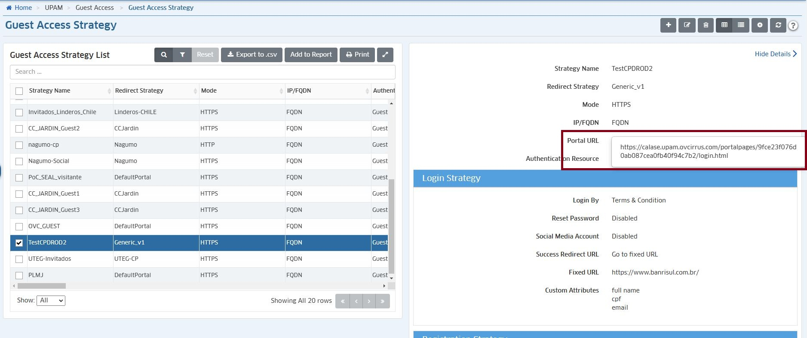
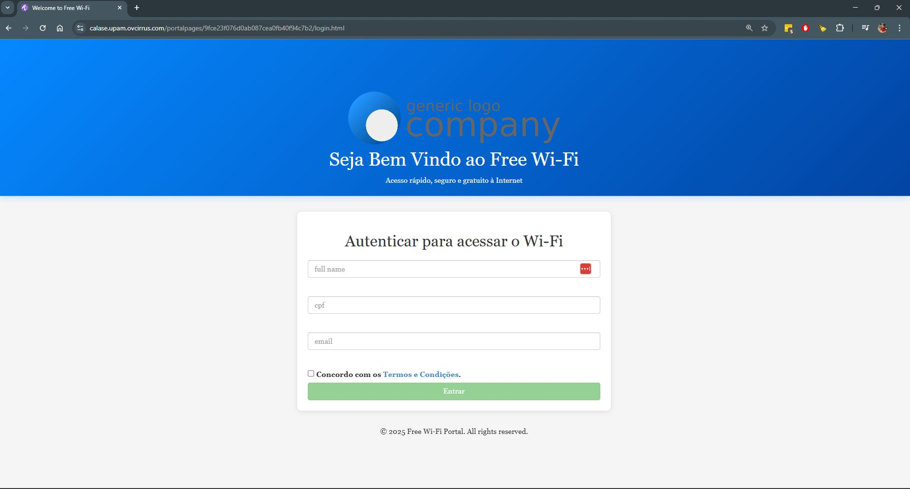

# 🔒 Captive Portal Customization in OmniVista

## 📜 Project Overview
This repository contains a **customizable Captive Portal template** for implementation within **OmniVista Cirrus and OmniVista 2500**, enabling enterprises to personalize their Wi-Fi network authentication interface.

The project has been developed to facilitate modification of **layout, input validations, and API integration**, delivering a more dynamic and professional user experience.

⚡ **Key Features:**
- **Responsive and customizable** interface (HTML, CSS, JavaScript)
- **Integration with OmniVista Cirrus and OmniVista 2500** for Wi-Fi authentication
- **Custom Fields support**, enabling creation of personalized fields within the user access form
- **Dynamic field validation**
- **Visual indicators** ✅ ❌ for user feedback
- **Streamlined configuration and deployment** within OmniVista

---

## 🌐 What is OmniVista Cirrus?
**OmniVista Cirrus** is a **cloud-based network management platform** offered by **Alcatel-Lucent Enterprise**.

It enables IT administrators to monitor, configure, and **manage both wireless and wired networks**, including:
✔ **Device provisioning and control**
✔ **Security and access management**
✔ **Captive Portal for user authentication**

---

## 🌐 What is OmniVista 2500?
**OmniVista 2500** is an **on-premises network management platform** offered by **Alcatel-Lucent Enterprise**.

It enables IT administrators to monitor, configure, and **manage both wireless and wired networks**, including:
✔ **Device provisioning and control**
✔ **Security and access management**
✔ **Captive Portal for user authentication**

---

## 🚪 What is the Captive Portal in OmniVista?
The **Captive Portal** is a **customizable authentication page** used to control user access to Wi-Fi networks.

📌 **OmniVista Captive Portal Features:**
- Display a **customized login screen** before granting internet access
- Create **diverse authentication methods** (credentials, social networks, voucher)
- **Implement security policies** for user control

---

## 🏗️ What are Custom Fields?
**Custom Fields** are **personalized fields** configured directly in **OmniVista Cirrus and OmniVista 2500**. They allow administrators to define **which information users must provide** before accessing the Wi-Fi network.

✔ Custom Fields Example:
- **Full Name** (`loginCustomAttr0`)
- **CPF** (`loginCustomAttr1`)
- **Email** (`loginCustomAttr2`)

These fields are **automatically referenced** within OmniVista, requiring no code modifications.

---

## 📂 Project Structure
Below is the structure of the main project files and directories:

```bash
📦 captive-portal-custom
│── 📂 css               # CSS style files for interface customization
│── 📂 flags             # Language selection flag images
│── 📂 fonts             # Portal font files
│── 📂 img               # Portal images, including logos and banners
│── 📂 js                # JavaScript scripts for portal interaction and validation
│── 📂 language          # Portal translation language files
│── 📂 terms             # Portal terms and conditions file
│
│── confirm.html         # Login confirmation page
│── declaration.html     # Privacy declaration / additional terms
│── facebooklogin.html   # Facebook login page
│── googlelogin.html     # Google login page
│── login.html           # Main Captive Portal login page
│── rainbowlogin.html    # Rainbow customized login page
│── register.html        # New user registration page
│── resetpassword.html   # User password reset page
│── success.html         # Successful login page
│── version.sha1         # Portal version information file
│── weixinlogin.html     # WeChat login page
```

---

## 🎨 Interface Customization
The interface can be modified directly through CSS and HTML files.

🎨 **Header Customization (Logo & Colors):**
```css
.header {
    background: linear-gradient(to bottom, #007BFF, #0056b3); /* Blue Gradient */
    color: white;
    text-align: center;
    padding: 30px 0;
}
```

🎨 **Logo Adjustment in `index.html`:**
```html
.header {
    background: linear-gradient(to bottom, #007BFF, #0056b3); /* Blue Gradient */
    color: white;
    text-align: center;
    padding: 30px 0;
}
```

## ✅ Implemented Validations

If we open the `index.html` file, we can examine how the customAttributes are identified:

```html
<div
          class="form-group"
          ng-repeat="attr in loginCustomAttrList track by $index"
        >
          <span
            class="input-con icon-right"
            ng-class="{'has-error': form[attr.attrName].$error.invalid}"
          >
            <input
              type="text"
              placeholder="{{attr.name}}"
              ng-model="attr.value"
              class="form-control"
              name="{{attr.attrName}}"
              id="{{attr.attrName}}"
              ng-change="$parent.updateAttrList($index, attr)"
            />
          </span>
          <div ng-show="form[attr.attrName].$error" style="color: red">
            {{form[attr.attrName].$error.errMessage | translate}}
          </div>
        </div>
```

The project includes dynamic validations for input fields in `script.js`:
- **Name** → Letters only, no special characters allowed
- **Tax ID** → Valid Brazilian CPF format (XXX.XXX.XXX-XX)
- **Email** → Correct format validation (example@email.com)

🔔 **User Feedback Indicators:**
- ✅ Green checkmark display when valid
- ❌ Red error display + message when invalid
```js
function showValidation(input, isValid, message) {
    let icon = isValid ? "✅" : "❌";
    input.classList.toggle("is-valid", isValid);
    input.classList.toggle("is-invalid", !isValid);
    input.nextElementSibling.innerHTML = `${icon} ${message}`;
}
```

```html
<script>
      /**
       * ============================================
       * Angular Document Ready Handler
       * ============================================
       * This block ensures that all DOM elements are fully loaded before executing any JavaScript
       * Similar to jQuery's $(document).ready()
       */
      angular.element(document).ready(function () {
        /**
         * Form Elements Initialization
         * Retrieves references to the three main custom input fields:
         * - loginCustom0: Full Name field
         * - loginCustom1: CPF (Brazilian ID) field
         * - loginCustom2: Email field
         */
        let loginCustom0 = document.getElementById("loginCustomAttr0");
        let loginCustom1 = document.getElementById("loginCustomAttr1");
        let loginCustom2 = document.getElementById("loginCustomAttr2");
        // Debug logging to confirm elements were found
        console.log(
          `Elemento loginCustomAttr0 encontrado com AngularJS: ${loginCustom0}`
        );
        console.log(
          `Elemento loginCustomAttr1 encontrado com AngularJS: ${loginCustom1}`
        );
        console.log(
          `Elemento loginCustomAttr2 encontrado com AngularJS: ${loginCustom2}`
        );

        /**
         * Error Element Creator
         * Creates or retrieves error message containers for each input
         * @param {HTMLElement} input - The input element to create error for
         * @returns {HTMLElement} - The error message container
         */
        function createErrorElement(input) {
          let errorId = input.getAttribute("name") + "Error";
          let errorElement = document.getElementById(errorId);

          if (!errorElement) {
            errorElement = document.createElement("div");
            errorElement.id = errorId;
            errorElement.style.color = "red";
            errorElement.style.fontSize = "12px";
            input.parentNode.appendChild(errorElement);
          }
          return errorElement;
        }

        /**
         * Validation Icon Creator
         * Creates or retrieves validation icon elements (✅/❌)
         * @param {HTMLElement} input - The input element to create icon for
         * @returns {HTMLElement} - The validation icon container
         */
        function createValidationIcon(input) {
          let iconId = input.getAttribute("name") + "Icon";
          let iconElement = document.getElementById(iconId);

          if (!iconElement) {
            iconElement = document.createElement("span");
            iconElement.id = iconId;
            iconElement.style.marginLeft = "10px";
            iconElement.style.fontSize = "14px";
            input.parentNode.appendChild(iconElement);
          }
          return iconElement;
        }

        /**
         * Full Name Validation
         * Validates user's full name with following rules:
         * - Must have at least 2 words (first and last name)
         * - Each word must be at least 2 characters
         * - No numbers or special characters allowed
         * - Auto-capitalizes first letter of each word
         */
        let errorElement0 = createErrorElement(loginCustom0);
        let iconElement0 = createValidationIcon(loginCustom0);

        loginCustom0.addEventListener("input", function () {
          let fullName = loginCustom0.value.trim();
          console.log(`Validando Nome Completo: ${fullName}`);

          // Função para capitalizar nome
          function capitalizeName(name) {
            return name.toLowerCase().replace(/(?:^|\s)\S/g, function (letter) {
              return letter.toUpperCase();
            });
          }

          function validateFullName(name) {
            // Main validation function with specific rules
            if (name.length === 0) {
              return {
                isValid: false,
                message: "O nome é obrigatório.",
              };
            }

            // Length validation
            if (name.length < 3) {
              return {
                isValid: false,
                message: "O nome deve ter pelo menos 3 caracteres.",
              };
            }
            if (name.length > 100) {
              return {
                isValid: false,
                message: "O nome não pode ter mais de 100 caracteres.",
              };
            }

            // Number check
            if (/\d/.test(name)) {
              return {
                isValid: false,
                message: "O nome não pode conter números.",
              };
            }

            // Special characters check (allows only letters, spaces and accents)
            if (!/^[A-Za-zÀ-ÖØ-öø-ÿ\s]*$/.test(name)) {
              return {
                isValid: false,
                message: "O nome não pode conter caracteres especiais.",
              };
            }

            // Word count validation (first and last name)
            const words = name.split(/\s+/).filter((word) => word.length > 0);
            if (words.length < 2) {
              return {
                isValid: false,
                message: "Por favor, insira nome e sobrenome.",
              };
            }

            // Word length validation
            if (words.some((word) => word.length < 2)) {
              return {
                isValid: false,
                message: "Cada parte do nome deve ter pelo menos 2 letras.",
              };
            }

            // Extra spaces check
            if (/\s{2,}/.test(name)) {
              return {
                isValid: false,
                message: "Evite espaços duplos entre as palavras.",
              };
            }

            return {
              isValid: true,
              message: "✅ Nome válido.",
            };
          }

          // Apply auto-capitalization
          let capitalizedName = capitalizeName(fullName);
          if (capitalizedName !== fullName) {
            loginCustom0.value = capitalizedName;
            fullName = capitalizedName;
          }

          // Executa validação
          const validation = validateFullName(fullName);

          // Mostra resultado da validação
          showValidation(
            loginCustom0,
            errorElement0,
            iconElement0,
            validation.isValid,
            validation.message
          );

          // Log para debug
          console.log(`Resultado da validação:`, validation);
        });

        // Validação CPF
        let errorElement1 = createErrorElement(loginCustom1);
        let iconElement1 = createValidationIcon(loginCustom1);
        /**
         * CPF Validation
         * Validates Brazilian CPF number with following rules:
         * - Must be 11 digits
         * - Applies proper formatting (XXX.XXX.XXX-XX)
         * - Validates check digits
         * - Prevents repeated numbers
         */
        loginCustom1.addEventListener("input", function () {
          let value = loginCustom1.value.replace(/\D/g, ""); // Remove caracteres não numéricos

          if (value.length > 11) {
            value = value.slice(0, 11);
          }
          // Apply CPF formatting mask
          value = value.replace(/(\d{3})(\d)/, "$1.$2");
          value = value.replace(/(\d{3})(\d)/, "$1.$2");
          value = value.replace(/(\d{3})(\d{1,2})$/, "$1-$2");

          loginCustom1.value = value;

          console.log(`Validando CPF: ${value}`);
          // Validate complete CPF
          if (value.length === 14) {
            const rawValue = value.replace(/\D/g, "");
            if (validarCPF(rawValue)) {
              showValidation(
                loginCustom1,
                errorElement1,
                iconElement1,
                true,
                "✅ CPF válido."
              );
            } else {
              showValidation(
                loginCustom1,
                errorElement1,
                iconElement1,
                false,
                "CPF inválido."
              );
            }
          } else {
            showValidation(
              loginCustom1,
              errorElement1,
              iconElement1,
              false,
              "CPF é obrigatório."
            );
          }
        });

        // Validação Email
        let errorElement2 = createErrorElement(loginCustom2);
        let iconElement2 = createValidationIcon(loginCustom2);
        /**
         * Email Validation
         * Validates email address with following rules:
         * - Must contain @ symbol
         * - Must have valid domain format
         * - Trims whitespace
         */
        loginCustom2.addEventListener("input", function () {
          console.log(`Validando Email`);

          const value = loginCustom2.value.trim();
          const isValidEmail = /^[^\s@]+@[^\s@]+\.[^\s@]+$/.test(value);

          console.log(`Validando Email: ${value}`);
          if (isValidEmail) {
            showValidation(
              loginCustom2,
              errorElement2,
              iconElement2,
              true,
              "✅ Email válido."
            );
          } else {
            showValidation(
              loginCustom2,
              errorElement2,
              iconElement2,
              false,
              "Digite um email válido."
            );
          }
        });

        /**
         * Validation State Manager
         * Updates the visual state of form inputs based on validation results
         * @param {HTMLElement} input - The input element being validated
         * @param {HTMLElement} errorElement - The error message container
         * @param {HTMLElement} iconElement - The validation icon container
         * @param {boolean} isValid - Whether the input is valid
         * @param {string} message - The message to display
         */
        function showValidation(
          input,
          errorElement,
          iconElement,
          isValid,
          message
        ) {
          console.log(
            `ShowValidation: ${input.getAttribute(
              "name"
            )} - isValid: ${isValid} - Message: "${message}"`
          );

          if (isValid) {
            input.classList.remove("is-invalid");
            input.classList.add("is-valid");

            if (errorElement) {
              errorElement.textContent = ""; // Remove a mensagem de erro
            }

            if (iconElement) {
              iconElement.textContent = "✅"; // Apenas um ícone ✅
              iconElement.style.color = "green";
            }
          } else {
            input.classList.remove("is-valid");
            input.classList.add("is-invalid");

            if (errorElement) {
              errorElement.textContent = message; // Apenas a mensagem de erro, sem ❌
            }

            if (iconElement) {
              if (iconElement.textContent !== "❌") {
                iconElement.textContent = "❌"; // Garante que ❌ só seja adicionado uma vez
                iconElement.style.color = "red";
              }
            }
          }
        }

        // Função para validar CPF
        function validarCPF(vCPF) {
          console.log(`Iniciando validação para CPF: "${vCPF}"`);
          vCPF = vCPF.replace(/[^\d]/g, "");

          if (vCPF.length !== 11 || /^([0-9])\1{10}$/.test(vCPF)) {
            console.log(
              "Validação CPF: FALHA. Formato incorreto ou sequência repetida."
            );
            return false;
          }

          function calculateDigit(cpf, factor) {
            let sum = 0;
            for (let i = 0; i < factor - 1; i++) {
              sum += parseInt(cpf.charAt(i)) * (factor - i);
            }
            const remainder = sum % 11;
            return remainder < 2 ? 0 : 11 - remainder;
          }

          const firstDigit = calculateDigit(vCPF, 10);
          if (firstDigit !== parseInt(vCPF.charAt(9))) {
            console.log("Validação CPF: FALHA. Primeiro dígito inválido.");
            return false;
          }

          const secondDigit = calculateDigit(vCPF, 11);
          const isValid = secondDigit === parseInt(vCPF.charAt(10));
          console.log(
            `Validação CPF: ${
              isValid ? "SUCESSO" : "FALHA. Segundo dígito inválido."
            }`
          );
          return isValid;
        }
      });
    </script>
```


---
## 🛠️ OmniVista Configuration 

**📌 Step-by-step guide to configure the Captive Portal in OmniVista**

- 1️⃣ Access OmniVista >> UPAM >> Captive Portal.
 

- 2️⃣ Click the `IMPORT` button. Create your Custom Template and upload your project's `.zip` file.
 

- 3️⃣ Access OmniVista >> UPAM >> Guest Access Strategy.

- 4️⃣ Create your Custom Guest Access Strategy:
  - "*Redirect Strategy" field: Select the Captive Portal created in step 2.
  - **[ ! IMPORTANT ! ]** "Login By" field: For this example Captive Portal, select the "Terms & Condition" option.
  - "Custom Attributes" field: Create the custom fields for your access form.
    - `loginCustomAttr0`: Full Name
    - `loginCustomAttr1`: CPF
    - `loginCustomAttr2`: Email
 

- 5️⃣ Save and apply the configurations.

- 6️⃣ To validate your custom Captive Portal, select your Guest Access Strategy created in the previous step again, and verify the "Portal URL"
 

- 7️⃣ Verify how your custom Captive Portal has been configured


---

## ⚙️ How to Run the Project?
Clone this repository and make the necessary modifications for your custom Captive Portal.
```git
git clone https://github.com/ALE-NAT/Automation-Projects/captive-portal-custom.git
```
---

## 📝 License

This project is distributed under the MIT license, permitting its use, modification, and sharing.

📜 Read more in `LICENSE`.

---

## 💡 Contributions
Contributions are welcome!

- 💬 If you encounter an issue or want to suggest an improvement, open a GitHub issue
- 🚀 To contribute, fork the repository, make your changes, and submit a pull request

👥 **Responsible Team**:

- Guilherme R. Miguel
- Development & Infrastructure Team